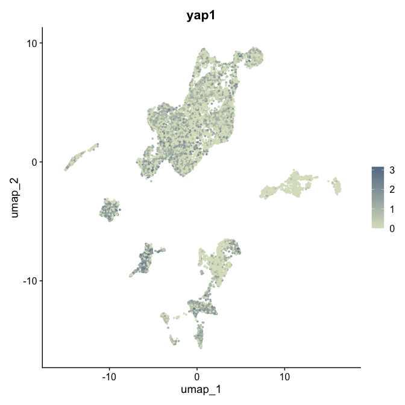
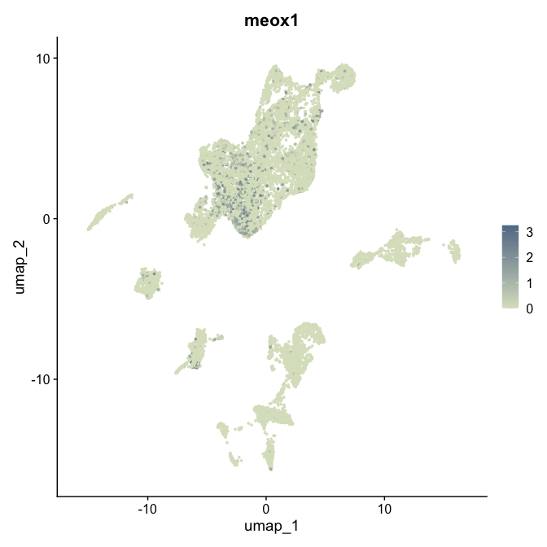
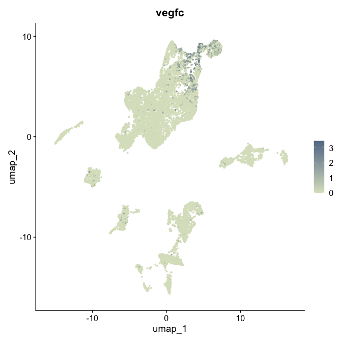
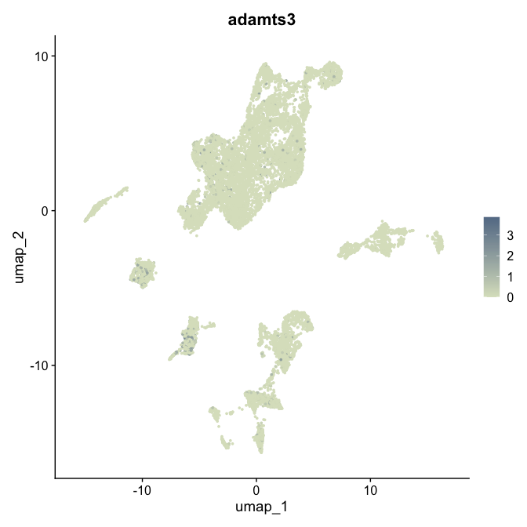
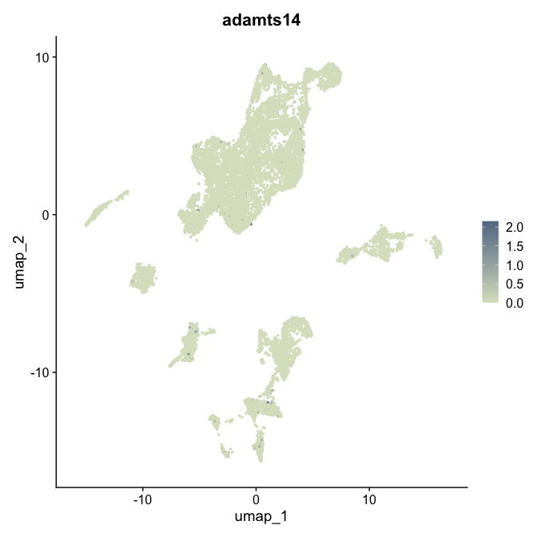
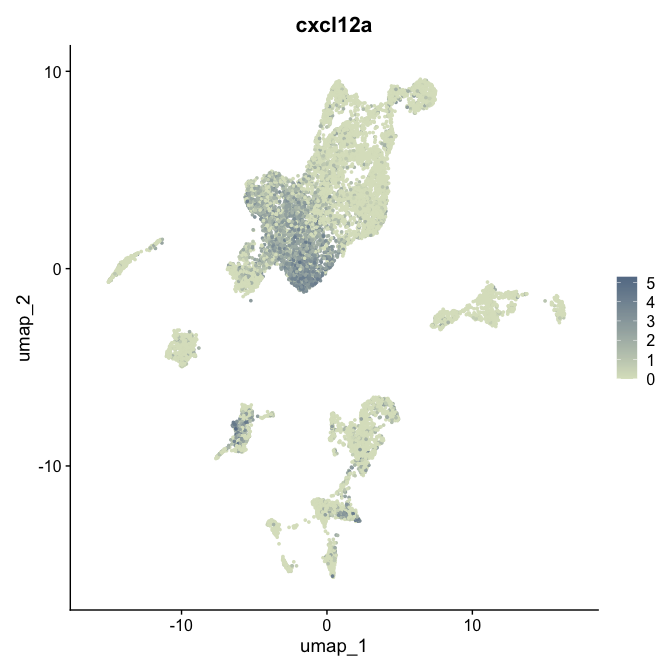
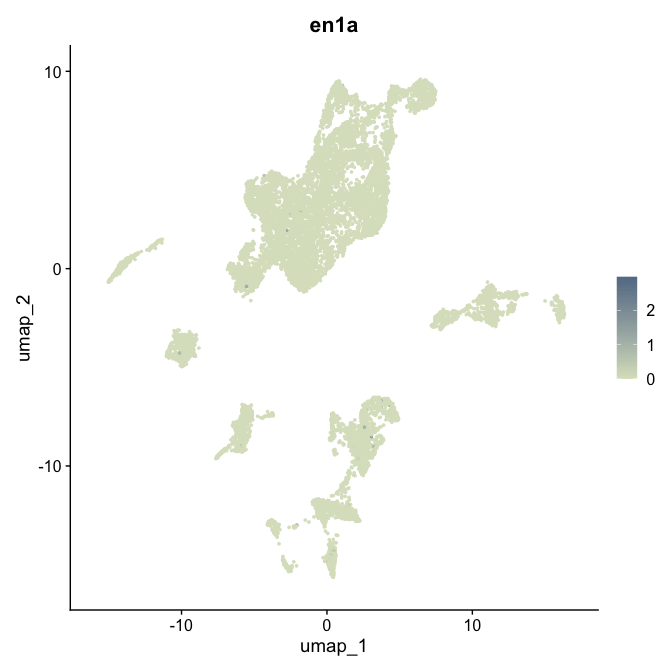
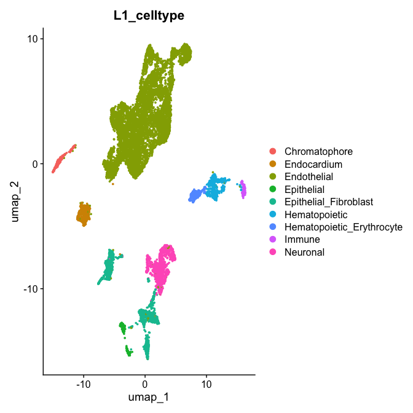

# README

Dev-facing data-prep document, no figures of note except a small UMAP reference block at the end. Runs the
merged-celltype DEG (`FindMarkers`) and topconfects (limma-voom + `limma_confects`) pipelines that the
`meox1_goanalysis*.Rmd` and `meox1_L1_fibroblast_goanalysis.Rmd` documents depend on. **Run this before those.**

- topconfects is complementary to p-values, not a replacement: DEG asks "what changed?", confects asks "what
  changed substantially?". Confects runs on top of the DGE pipeline and inherits its assumptions/power.
- Two grain levels are covered: Level 3 (LEC/VEC merged groups) and Level 1 (fibroblast-only).

## Outputs

All under `../output/figure_extended/dge_confects/`:

- `meox1_Level_03_DEG_mutVSwt_L3_celltype_merged_VEC_merged_LEC_fc0.00_minpct_0.01.csv`
- `meox1_Level_03_DEG_mutVSwt_L3_celltype_merged_VEC_merged_LEC_hippo_targets_fc0.00_minpct_0.00.csv`
- `meox1_dataset_TopConfects_MergedGroups_mutVSwt_FDR0.05.csv`
- `meox1_dataset_TopConfects_L3_celltype_merged_VEC_merged_LEC_hippo_targets_MergedGroups_mutVSwt_FDR0.05.csv`
- `meox1_L1_fibroblasts_Level_01_DEG_mutVSwt_L1_celltype_fc0.00_minpct_0.01.csv`
- `meox1_L1_fibroblasts_Level_01_DEG_mutVSwt_celltype_fibroblasts_fc0.00_minpct_0.00.csv`
- `meox1_dataset_TopConfects_L1_Fibroblasts_mutVSwt_FDR0.05.csv`
- `meox1_dataset_TopConfects_L1_celltype_fibroblast_targets_L1_Fibroblasts_mutVSwt_FDR0.05.csv`
- `meox1_L1_fibroblasts__<gene>_UMAP*.pdf` and `meox1_L1_fibroblasts__L1_celltype_UMAP*.pdf` (small reference set)

## Initial setup


```{.r .fold-hide}
library(tidyverse)
```

```
## ── Attaching core tidyverse packages ──────────────────────────────────────────────────────────────────────────────── tidyverse 2.0.0 ──
## ✔ dplyr     1.2.1     ✔ readr     2.2.0
## ✔ forcats   1.0.1     ✔ stringr   1.6.0
## ✔ ggplot2   4.0.3     ✔ tibble    3.3.1
## ✔ lubridate 1.9.5     ✔ tidyr     1.3.2
## ✔ purrr     1.2.2     
## ── Conflicts ────────────────────────────────────────────────────────────────────────────────────────────────── tidyverse_conflicts() ──
## ✖ dplyr::filter() masks stats::filter()
## ✖ dplyr::lag()    masks stats::lag()
## ℹ Use the conflicted package (<http://conflicted.r-lib.org/>) to force all conflicts to become errors
```

```{.r .fold-hide}
library(here)
```

```
## here() starts at /Users/chentyrone/Downloads/repos/wflow_yap1_meox1_paper
```

```{.r .fold-hide}
library(Seurat)
```

```
## Loading required package: SeuratObject
## Loading required package: sp
## 
## Attaching package: 'SeuratObject'
## 
## The following objects are masked from 'package:base':
## 
##     intersect, t
```

```{.r .fold-hide}
library(scDblFinder)
```

```
## Loading required package: SingleCellExperiment
## Loading required package: SummarizedExperiment
## Loading required package: MatrixGenerics
## Loading required package: matrixStats
## 
## Attaching package: 'matrixStats'
## 
## The following object is masked from 'package:dplyr':
## 
##     count
## 
## 
## Attaching package: 'MatrixGenerics'
## 
## The following objects are masked from 'package:matrixStats':
## 
##     colAlls, colAnyNAs, colAnys, colAvgsPerRowSet, colCollapse,
##     colCounts, colCummaxs, colCummins, colCumprods, colCumsums,
##     colDiffs, colIQRDiffs, colIQRs, colLogSumExps, colMadDiffs,
##     colMads, colMaxs, colMeans2, colMedians, colMins, colOrderStats,
##     colProds, colQuantiles, colRanges, colRanks, colSdDiffs, colSds,
##     colSums2, colTabulates, colVarDiffs, colVars, colWeightedMads,
##     colWeightedMeans, colWeightedMedians, colWeightedSds,
##     colWeightedVars, rowAlls, rowAnyNAs, rowAnys, rowAvgsPerColSet,
##     rowCollapse, rowCounts, rowCummaxs, rowCummins, rowCumprods,
##     rowCumsums, rowDiffs, rowIQRDiffs, rowIQRs, rowLogSumExps,
##     rowMadDiffs, rowMads, rowMaxs, rowMeans2, rowMedians, rowMins,
##     rowOrderStats, rowProds, rowQuantiles, rowRanges, rowRanks,
##     rowSdDiffs, rowSds, rowSums2, rowTabulates, rowVarDiffs, rowVars,
##     rowWeightedMads, rowWeightedMeans, rowWeightedMedians,
##     rowWeightedSds, rowWeightedVars
## 
## Loading required package: GenomicRanges
## Loading required package: stats4
## Loading required package: BiocGenerics
## 
## Attaching package: 'BiocGenerics'
## 
## The following object is masked from 'package:SeuratObject':
## 
##     intersect
## 
## The following objects are masked from 'package:lubridate':
## 
##     intersect, setdiff, union
## 
## The following objects are masked from 'package:dplyr':
## 
##     combine, intersect, setdiff, union
## 
## The following objects are masked from 'package:stats':
## 
##     IQR, mad, sd, var, xtabs
## 
## The following objects are masked from 'package:base':
## 
##     anyDuplicated, aperm, append, as.data.frame, basename, cbind,
##     colnames, dirname, do.call, duplicated, eval, evalq, Filter, Find,
##     get, grep, grepl, intersect, is.unsorted, lapply, Map, mapply,
##     match, mget, order, paste, pmax, pmax.int, pmin, pmin.int,
##     Position, rank, rbind, Reduce, rownames, sapply, saveRDS, setdiff,
##     table, tapply, union, unique, unsplit, which.max, which.min
## 
## Loading required package: S4Vectors
## 
## Attaching package: 'S4Vectors'
## 
## The following objects are masked from 'package:lubridate':
## 
##     second, second<-
## 
## The following objects are masked from 'package:dplyr':
## 
##     first, rename
## 
## The following object is masked from 'package:tidyr':
## 
##     expand
## 
## The following object is masked from 'package:utils':
## 
##     findMatches
## 
## The following objects are masked from 'package:base':
## 
##     expand.grid, I, unname
## 
## Loading required package: IRanges
## 
## Attaching package: 'IRanges'
## 
## The following object is masked from 'package:sp':
## 
##     %over%
## 
## The following object is masked from 'package:lubridate':
## 
##     %within%
## 
## The following objects are masked from 'package:dplyr':
## 
##     collapse, desc, slice
## 
## The following object is masked from 'package:purrr':
## 
##     reduce
## 
## Loading required package: GenomeInfoDb
## Loading required package: Biobase
## Welcome to Bioconductor
## 
##     Vignettes contain introductory material; view with
##     'browseVignettes()'. To cite Bioconductor, see
##     'citation("Biobase")', and for packages 'citation("pkgname")'.
## 
## 
## Attaching package: 'Biobase'
## 
## The following object is masked from 'package:MatrixGenerics':
## 
##     rowMedians
## 
## The following objects are masked from 'package:matrixStats':
## 
##     anyMissing, rowMedians
## 
## 
## Attaching package: 'SummarizedExperiment'
## 
## The following object is masked from 'package:Seurat':
## 
##     Assays
## 
## The following object is masked from 'package:SeuratObject':
## 
##     Assays
```

```{.r .fold-hide}
library(ggpubr)
library(clustree)
```

```
## Loading required package: ggraph
## 
## Attaching package: 'ggraph'
## 
## The following object is masked from 'package:sp':
## 
##     geometry
```

```{.r .fold-hide}
library(patchwork)
library(scater)
```

```
## Loading required package: scuttle
```

```{.r .fold-hide}
library(scran)
library(qs2)
```

```
## qs2 0.2.1
```

```{.r .fold-hide}
library(scGate)
library(limma)
```

```
## 
## Attaching package: 'limma'
## 
## The following object is masked from 'package:scater':
## 
##     plotMDS
## 
## The following object is masked from 'package:BiocGenerics':
## 
##     plotMA
```

```{.r .fold-hide}
library(edgeR)
```

```
## 
## Attaching package: 'edgeR'
## 
## The following object is masked from 'package:SingleCellExperiment':
## 
##     cpm
```

```{.r .fold-hide}
library(topconfects)

outfile_dir <- "../output/figure_extended/dge_confects/"

hippo_targets <- c(
    "yap1",
    "meox1",
    "wwtr1",
    "ccn2a",
    "ccn2b",
    "amotl2a",
    "amotl2b",
    "ccn1",
    "ccn1l2",
    "cavin1b",
    "cavin2a",
    "cavin2b",
    "bmp4"
)

fibroblast_targets <- c(
    "yap1",
    "meox1",
    "ccbe1",
    "vegfc",
    "adamts3",
    "adamts14",
    "cxcl12a",
    "svep1",
    "en1a",
    "en1b",
    "prox1a"
)
```

## Level 3: DEG on merged VEC/LEC groups

Source: `meox1_deg_celltype.R`. Merges `hmVEC + mVEC` and `LEC + pre_muLEC` into two comparison groups before
running `FindMarkers(mutant vs wildtype)`, once on all genes and once restricted to the Hippo target gene set.


```{.r .fold-hide}
run_degs_mut_wt_custom_groups <- function(seurat,
                            group,
                            save_dir,
                            custom_groups = NULL,
                            log2_t = 0,
                            min_pct = 0.01) {
  # use custom groups if passed
  if (is.null(custom_groups)) {
    unique_ids <- unique(seurat@meta.data[, group])
    eval_list <- setNames(as.list(unique_ids), unique_ids)
  } else {
    eval_list <- custom_groups
  }

  # parse named blocks
  all_results <- lapply(names(eval_list), function(block_name) {
    target_identities <- eval_list[[block_name]]

    # merge multiple idents
    seurat_subset <- subset(seurat, cells = colnames(seurat)[seurat@meta.data[, group] %in% target_identities])

    # if no match, skip
    if (ncol(seurat_subset) == 0) return(NULL)

    seurat_subset$Genotype <- factor(seurat_subset$Genotype, levels = c("wildtype", "meox1_mutant"))

    if (all(table(seurat_subset$Genotype) > 5)) {
      Idents(seurat_subset) <- "Genotype"
      FindMarkers(object = seurat_subset,
                  group.by = "Genotype",
                  ident.1 = "meox1_mutant",
                  ident.2 = "wildtype",
                  min.pct = min_pct,
                  assay = "RNA",
                  logfc.threshold = log2_t) %>%
        rownames_to_column("Gene") %>%
        mutate(group = block_name) # Labels output row with your custom block name
    }
  }) %>% bind_rows()

  # tag filename if custom grouping was deployed
  file_suffix <- ifelse(is.null(custom_groups), group, paste0(group, "_merged_VEC_merged_LEC"))
  file_name <- sprintf("%s/meox1_%s_DEG_mutVSwt_%s_fc%0.2f_minpct_%0.2f.csv", save_dir, seurat@misc$name, file_suffix, log2_t, min_pct)
  write.csv(file = file_name, x = all_results, row.names = FALSE)

  return(all_results)
}

run_degs_mut_wt_selected_genes_custom_groups <- function(seurat,
                                                         group,
                                                         custom_groups,
                                                         save_dir,
                                                         features_in,
                                                         export_name,
                                                         geno_col = "Genotype",
                                                         mut_id = "meox1_mutant",
                                                         wt_id = "wildtype",
                                                         project_name = "meox1_dataset",
                                                         log2_t = 0,
                                                         min_pct = 0) {

  p_name <- if (!is.null(seurat@misc$name)) seurat@misc$name else project_name

  # Iterate over the NAMES of your custom merged list
  all_results <- lapply(names(custom_groups), function(new_group_name) {

    # Extract the vector of original celltypes to merge
    target_identities <- custom_groups[[new_group_name]]

    # Grab cells matching ANY of the target identities
    cells_to_keep <- colnames(seurat)[seurat@meta.data[, group] %in% target_identities]

    # Skip if none of these cells exist
    if (length(cells_to_keep) == 0) return(NULL)

    seurat_subset <- subset(seurat, cells = cells_to_keep)

    # Factor the genotype column dynamically
    seurat_subset[[geno_col]] <- factor(
        seurat_subset@meta.data[, geno_col], levels = c(wt_id, mut_id)
        )

    # Only run if we have enough cells per genotype in this merged block
    if (all(table(seurat_subset[[geno_col]]) > 5)) {
      Idents(seurat_subset) <- geno_col

      FindMarkers(object = seurat_subset,
                  ident.1 = mut_id,
                  ident.2 = wt_id,
                  min.pct = min_pct,
                  assay = "RNA",
                  features = features_in,         # Restrict test to your selected genes
                  logfc.threshold = log2_t) %>%
        rownames_to_column("Gene") %>%
        mutate(group = new_group_name)        # Tag with your custom merged name
    }
  }) %>% bind_rows()

  # Create a distinct filename using the export_name (e.g., "hippo_targets")
  file_name <- sprintf("%s/meox1_%s_DEG_mutVSwt_%s_fc%0.2f_minpct_%0.2f.csv",
                       save_dir, seurat@misc$name, export_name, log2_t, min_pct)
  write.csv(file = file_name, x = all_results, row.names = FALSE)

  return(all_results)
}
```


```{.r .fold-hide}
infile_path <- "../../Saki_data/paper/D10051_meox1_dataset_Level_03_annotated.qs2"
data <- qs_read(infile_path)

custom_groups <- list(
    "hmVEC__mVEC" = c("hmVEC", "mVEC"),
    "LEC__pre_muLEC" = c("LEC", "pre_muLEC")
)

data$celltype_genotype <- paste(data$L3_celltype, data$Genotype, sep = "_")

# all celltypes
degs <- run_degs_mut_wt_custom_groups(
    seurat = data,
    group = "L3_celltype",
    custom_groups = custom_groups,
    save_dir = outfile_dir
    )

# all celltypes - hippo genes only
degs_hippo <- run_degs_mut_wt_selected_genes_custom_groups(
    seurat = data,
    log2_t = 0,
    min_pct= 0,
    features_in = hippo_targets,
    custom_groups = custom_groups,
    group = "L3_celltype",
    save_dir = outfile_dir,
    export_name = "L3_celltype_merged_VEC_merged_LEC_hippo_targets"
    )
```

## Level 3: topconfects on merged VEC/LEC groups

Source: `meox1_confect_celltype.R`. Pseudobulks the same merged groups, runs limma-voom then `limma_confects`.


```{.r .fold-hide}
run_topconfects_custom_groups <- function(seurat,
                                          meta_column,
                                          custom_groups,
                                          save_dir,
                                          geno_col = "Genotype",
                                          mut_id = "meox1_mutant",
                                          wt_id = "wildtype",
                                          project_name = "meox1_dataset",
                                          fdr_target = 0.05) {  # topconfects uses FDR instead of p_val

  p_name <- if (!is.null(seurat@misc$name)) seurat@misc$name else project_name

  all_results <- lapply(names(custom_groups), function(new_group_name) {

    target_identities <- custom_groups[[new_group_name]]
    cells_to_keep <- colnames(seurat)[seurat@meta.data[, meta_column] %in% target_identities]

    if (length(cells_to_keep) == 0) return(NULL)

    seurat_subset <- subset(seurat, cells = cells_to_keep)

    # Factor the genotype (WT must be the first level to act as the reference/intercept)
    seurat_subset[[geno_col]] <- factor(seurat_subset@meta.data[, geno_col], levels = c(wt_id, mut_id))

    # Ensure sufficient cells for a valid model
    if (all(table(seurat_subset[[geno_col]]) > 5)) {
      cat(sprintf("Running limma + topconfects on group: %s...\n", new_group_name))

      # 1. Extract raw counts
      # Note: If using Seurat v5, you may need layer = "counts". For v4, slot = "counts" is standard.
      counts_matrix <- GetAssayData(seurat_subset, assay = "RNA", layer = "counts")

      # 2. Build the design matrix for limma
      design <- model.matrix(~ seurat_subset@meta.data[[geno_col]])
      # The coefficient for the mutant will be the 2nd column
      target_coef <- 2

      # 3. Run limma-voom pipeline (Treating cells as replicates)
      dge <- DGEList(counts = counts_matrix)
      dge <- calcNormFactors(dge)
      v <- voom(dge, design, plot = FALSE)
      fit <- lmFit(v, design)
      fit <- eBayes(fit)

      # 4. Run topconfects on the limma fit
      confects_res <- limma_confects(fit, coef = target_coef, fdr = fdr_target)

      # 5. Extract the results table and tag it with our custom group name
      # topconfects returns a specialized list; the dataframe we want is in $table
      res_df <- confects_res$table %>%
        mutate(group = new_group_name)

      return(res_df)
    }
  }) %>% bind_rows()

  # Export the compiled table
  file_name <- sprintf("%s/meox1_%s_TopConfects_MergedGroups_mutVSwt_FDR%0.2f.csv", save_dir, p_name, fdr_target)
  write.csv(file = file_name, x = all_results, row.names = FALSE)

  return(all_results)
}

run_topconfects_selected_genes_custom_groups <- function(seurat,
                                                         meta_column,
                                                         custom_groups,
                                                         features_in,
                                                         export_name,
                                                         save_dir,
                                                         geno_col = "Genotype",
                                                         mut_id = "meox1_mutant",
                                                         wt_id = "wildtype",
                                                         project_name = "meox1_dataset",
                                                         fdr_target = 0.05) {

  p_name <- if (!is.null(seurat@misc$name)) seurat@misc$name else project_name

  all_results <- lapply(names(custom_groups), function(new_group_name) {

    target_identities <- custom_groups[[new_group_name]]
    cells_to_keep <- colnames(seurat)[seurat@meta.data[, meta_column] %in% target_identities]
    if (length(cells_to_keep) == 0) return(NULL)

    seurat_subset <- subset(seurat, cells = cells_to_keep)
    seurat_subset[[geno_col]] <- factor(seurat_subset@meta.data[, geno_col], levels = c(wt_id, mut_id))

    if (all(table(seurat_subset[[geno_col]]) > 5)) {
      cat(sprintf("Running limma + topconfects (Selected Genes) on: %s...\n", new_group_name))

      counts_matrix <- GetAssayData(seurat_subset, assay = "RNA", layer = "counts")
      valid_features <- features_in[features_in %in% rownames(counts_matrix)]
      counts_matrix <- counts_matrix[valid_features, ]

      keep_cells <- colSums(counts_matrix) > 0
      counts_matrix <- counts_matrix[, keep_cells]
      seurat_subset <- seurat_subset[, keep_cells]

      design <- model.matrix(~ seurat_subset@meta.data[[geno_col]])
      dge <- DGEList(counts = counts_matrix)
      dge <- calcNormFactors(dge)
      v <- voom(dge, design, plot = FALSE)
      fit <- lmFit(v, design)
      fit <- eBayes(fit)

      confects_res <- limma_confects(fit, coef = 2, fdr = fdr_target)

      return(confects_res$table %>% mutate(group = new_group_name))
    }
  }) %>% bind_rows()

  file_name <- sprintf("%s/meox1_%s_TopConfects_%s_MergedGroups_mutVSwt_FDR%0.2f.csv",
                       save_dir, p_name, export_name, fdr_target)
  write.csv(file = file_name, x = all_results, row.names = FALSE)

  return(all_results)
}
```


```{.r .fold-hide}
confect_results <- run_topconfects_custom_groups(
  seurat = data,
  meta_column = "L3_celltype",
  custom_groups = custom_groups,
  save_dir = outfile_dir,
  fdr_target = 0.05
)
```

```
## Running limma + topconfects on group: hmVEC__mVEC...
## Running limma + topconfects on group: LEC__pre_muLEC...
```

```{.r .fold-hide}
confect_hippo <- run_topconfects_selected_genes_custom_groups(
  seurat = data,
  meta_column = "L3_celltype",
  custom_groups = custom_groups,
  features_in = hippo_targets,
  export_name = "L3_celltype_merged_VEC_merged_LEC_hippo_targets",
  save_dir = outfile_dir
)
```

```
## Running limma + topconfects (Selected Genes) on: hmVEC__mVEC...
```

```
## Warning in max(abs(logR)): no non-missing arguments to max; returning -Inf
## Warning in max(abs(logR)): no non-missing arguments to max; returning -Inf
## Warning in max(abs(logR)): no non-missing arguments to max; returning -Inf
## Warning in max(abs(logR)): no non-missing arguments to max; returning -Inf
## Warning in max(abs(logR)): no non-missing arguments to max; returning -Inf
## Warning in max(abs(logR)): no non-missing arguments to max; returning -Inf
## Warning in max(abs(logR)): no non-missing arguments to max; returning -Inf
## Warning in max(abs(logR)): no non-missing arguments to max; returning -Inf
## Warning in max(abs(logR)): no non-missing arguments to max; returning -Inf
## Warning in max(abs(logR)): no non-missing arguments to max; returning -Inf
## Warning in max(abs(logR)): no non-missing arguments to max; returning -Inf
## Warning in max(abs(logR)): no non-missing arguments to max; returning -Inf
## Warning in max(abs(logR)): no non-missing arguments to max; returning -Inf
## Warning in max(abs(logR)): no non-missing arguments to max; returning -Inf
## Warning in max(abs(logR)): no non-missing arguments to max; returning -Inf
## Warning in max(abs(logR)): no non-missing arguments to max; returning -Inf
## Warning in max(abs(logR)): no non-missing arguments to max; returning -Inf
## Warning in max(abs(logR)): no non-missing arguments to max; returning -Inf
## Warning in max(abs(logR)): no non-missing arguments to max; returning -Inf
## Warning in max(abs(logR)): no non-missing arguments to max; returning -Inf
## Warning in max(abs(logR)): no non-missing arguments to max; returning -Inf
## Warning in max(abs(logR)): no non-missing arguments to max; returning -Inf
## Warning in max(abs(logR)): no non-missing arguments to max; returning -Inf
## Warning in max(abs(logR)): no non-missing arguments to max; returning -Inf
## Warning in max(abs(logR)): no non-missing arguments to max; returning -Inf
## Warning in max(abs(logR)): no non-missing arguments to max; returning -Inf
## Warning in max(abs(logR)): no non-missing arguments to max; returning -Inf
## Warning in max(abs(logR)): no non-missing arguments to max; returning -Inf
## Warning in max(abs(logR)): no non-missing arguments to max; returning -Inf
## Warning in max(abs(logR)): no non-missing arguments to max; returning -Inf
## Warning in max(abs(logR)): no non-missing arguments to max; returning -Inf
## Warning in max(abs(logR)): no non-missing arguments to max; returning -Inf
## Warning in max(abs(logR)): no non-missing arguments to max; returning -Inf
## Warning in max(abs(logR)): no non-missing arguments to max; returning -Inf
## Warning in max(abs(logR)): no non-missing arguments to max; returning -Inf
## Warning in max(abs(logR)): no non-missing arguments to max; returning -Inf
## Warning in max(abs(logR)): no non-missing arguments to max; returning -Inf
## Warning in max(abs(logR)): no non-missing arguments to max; returning -Inf
## Warning in max(abs(logR)): no non-missing arguments to max; returning -Inf
## Warning in max(abs(logR)): no non-missing arguments to max; returning -Inf
## Warning in max(abs(logR)): no non-missing arguments to max; returning -Inf
## Warning in max(abs(logR)): no non-missing arguments to max; returning -Inf
## Warning in max(abs(logR)): no non-missing arguments to max; returning -Inf
```

```
## Running limma + topconfects (Selected Genes) on: LEC__pre_muLEC...
```

```
## Warning in max(abs(logR)): no non-missing arguments to max; returning -Inf
## Warning in max(abs(logR)): no non-missing arguments to max; returning -Inf
## Warning in max(abs(logR)): no non-missing arguments to max; returning -Inf
## Warning in max(abs(logR)): no non-missing arguments to max; returning -Inf
## Warning in max(abs(logR)): no non-missing arguments to max; returning -Inf
## Warning in max(abs(logR)): no non-missing arguments to max; returning -Inf
## Warning in max(abs(logR)): no non-missing arguments to max; returning -Inf
## Warning in max(abs(logR)): no non-missing arguments to max; returning -Inf
## Warning in max(abs(logR)): no non-missing arguments to max; returning -Inf
## Warning in max(abs(logR)): no non-missing arguments to max; returning -Inf
## Warning in max(abs(logR)): no non-missing arguments to max; returning -Inf
## Warning in max(abs(logR)): no non-missing arguments to max; returning -Inf
## Warning in max(abs(logR)): no non-missing arguments to max; returning -Inf
## Warning in max(abs(logR)): no non-missing arguments to max; returning -Inf
## Warning in max(abs(logR)): no non-missing arguments to max; returning -Inf
## Warning in max(abs(logR)): no non-missing arguments to max; returning -Inf
## Warning in max(abs(logR)): no non-missing arguments to max; returning -Inf
## Warning in max(abs(logR)): no non-missing arguments to max; returning -Inf
## Warning in max(abs(logR)): no non-missing arguments to max; returning -Inf
```

## Level 1: DEG + topconfects on fibroblasts, plus reference UMAPs

Source: `meox1_deg_L1_fibroblasts.R` + `meox1_L1_confect_fibroblast.R`. Same two pipelines (DEG, topconfects)
applied to the `Epithelial_Fibroblast` group at Level 1 instead, using a fibroblast/lymphatic-relevant gene panel.
Also produces small reference UMAPs of the fibroblast marker panel and of `L1_celltype` itself (not manuscript
figures, just for eyeballing gene distribution before committing to the DEG list above).


```{.r .fold-hide}
infile_path_l1 <- "../../Saki_data/paper/D10051_meox1_dataset_Level_01_annotated.qs2"
data_l1 <- qs_read(infile_path_l1)

table(data_l1@meta.data$L1_celltype)
```

```
## 
##             Chromatophore               Endocardium               Endothelial 
##                       293                       427                      7683 
##                Epithelial     Epithelial_Fibroblast             Hematopoietic 
##                       187                      1183                       520 
## Hematopoietic_Erythrocyte                    Immune                  Neuronal 
##                       232                       126                      1013
```

```{.r .fold-hide}
custom_groups_l1 <- list(
    "Epithelial_Fibroblast" = c("Epithelial_Fibroblast")
)
```


```{.r .fold-hide}
# DEG - all L1 celltypes, then fibroblast-only restricted to the panel
degs_l1 <- run_degs_mut_wt_custom_groups(
    seurat = data_l1,
    group = "L1_celltype",
    custom_groups = custom_groups_l1,
    save_dir = outfile_dir
    )

degs_l1_hippo <- run_degs_mut_wt_selected_genes_custom_groups(
    seurat = data_l1,
    log2_t = 0,
    min_pct= 0,
    features_in = fibroblast_targets,
    custom_groups = custom_groups_l1,
    group = "L1_celltype",
    save_dir = outfile_dir,
    export_name = "celltype_fibroblasts"
    )

# topconfects - same fibroblast group
confect_results_l1 <- run_topconfects_custom_groups(
  seurat = data_l1,
  meta_column = "L1_celltype",
  custom_groups = custom_groups_l1,
  save_dir = outfile_dir,
  fdr_target = 0.05
)
```

```
## Running limma + topconfects on group: Epithelial_Fibroblast...
```

```{.r .fold-hide}
confect_hippo_l1 <- run_topconfects_selected_genes_custom_groups(
  seurat = data_l1,
  meta_column = "L1_celltype",
  custom_groups = custom_groups_l1,
  features_in = fibroblast_targets,
  export_name = "L1_celltype_fibroblast_targets",
  save_dir = outfile_dir
)
```

```
## Running limma + topconfects (Selected Genes) on: Epithelial_Fibroblast...
```

```
## Warning in max(abs(logR)): no non-missing arguments to max; returning -Inf
## Warning in max(abs(logR)): no non-missing arguments to max; returning -Inf
## Warning in max(abs(logR)): no non-missing arguments to max; returning -Inf
## Warning in max(abs(logR)): no non-missing arguments to max; returning -Inf
## Warning in max(abs(logR)): no non-missing arguments to max; returning -Inf
## Warning in max(abs(logR)): no non-missing arguments to max; returning -Inf
## Warning in max(abs(logR)): no non-missing arguments to max; returning -Inf
## Warning in max(abs(logR)): no non-missing arguments to max; returning -Inf
## Warning in max(abs(logR)): no non-missing arguments to max; returning -Inf
## Warning in max(abs(logR)): no non-missing arguments to max; returning -Inf
## Warning in max(abs(logR)): no non-missing arguments to max; returning -Inf
## Warning in max(abs(logR)): no non-missing arguments to max; returning -Inf
## Warning in max(abs(logR)): no non-missing arguments to max; returning -Inf
## Warning in max(abs(logR)): no non-missing arguments to max; returning -Inf
## Warning in max(abs(logR)): no non-missing arguments to max; returning -Inf
## Warning in max(abs(logR)): no non-missing arguments to max; returning -Inf
## Warning in max(abs(logR)): no non-missing arguments to max; returning -Inf
## Warning in max(abs(logR)): no non-missing arguments to max; returning -Inf
## Warning in max(abs(logR)): no non-missing arguments to max; returning -Inf
## Warning in max(abs(logR)): no non-missing arguments to max; returning -Inf
## Warning in max(abs(logR)): no non-missing arguments to max; returning -Inf
## Warning in max(abs(logR)): no non-missing arguments to max; returning -Inf
## Warning in max(abs(logR)): no non-missing arguments to max; returning -Inf
## Warning in max(abs(logR)): no non-missing arguments to max; returning -Inf
## Warning in max(abs(logR)): no non-missing arguments to max; returning -Inf
## Warning in max(abs(logR)): no non-missing arguments to max; returning -Inf
## Warning in max(abs(logR)): no non-missing arguments to max; returning -Inf
## Warning in max(abs(logR)): no non-missing arguments to max; returning -Inf
## Warning in max(abs(logR)): no non-missing arguments to max; returning -Inf
```


```{.r .fold-hide}
plot_name <- "meox1_L1_fibroblasts_"
height <- 5; width <- 5
for (feature in fibroblast_targets) {
    plot <- Seurat::FeaturePlot(data_l1, features = feature, cols = c("#dbe2c6", "#657c95"),
        pt.size = 0.5)
    print(plot)
    ggplot2::ggsave(plot = plot, filename = paste0(plot_name, "_", feature, "_UMAP_",
        feature, ".pdf"), path = outfile_dir, device = "pdf", height = height +
        2, width = width + 2)
    plot_strip <- plot + Seurat::NoAxes() + Seurat::NoLegend() +
        ggplot2::theme(plot.title = ggplot2::element_blank())
    ggplot2::ggsave(plot = plot_strip, filename = paste0(plot_name, "_", feature,
        "_UMAP_STRIPPED_", feature, ".pdf"), path = outfile_dir, device = "pdf",
        height = height, width = width)
}
```

<!-- --><!-- --><!-- --><!-- --><!-- --><!-- --><!-- --><!-- --><!-- --><!-- --><!-- -->

```{.r .fold-hide}
feature <- "L1_celltype"
plot_name <- "meox1_L1_fibroblasts_"
plot <- Seurat::DimPlot(data_l1, group.by = feature, shuffle = TRUE,
    pt.size = 0.5)
print(plot)
```

<!-- -->

```{.r .fold-hide}
ggplot2::ggsave(plot = plot, filename = paste0(plot_name, "_", feature, "_UMAP.pdf"),
    path = outfile_dir, device = "pdf", height = height +
    2, width = width + 4)
plot_strip <- plot + Seurat::NoAxes() + Seurat::NoLegend() +
    ggplot2::theme(plot.title = ggplot2::element_blank())
ggplot2::ggsave(plot = plot_strip, filename = paste0(plot_name, "_", feature,
    "_UMAP_STRIPPED.pdf"), path = outfile_dir, device = "pdf",
    height = height, width = width)
```

## For developers

Sample run command:


``` bash
Rscript -e "
rmarkdown::render(
  'meox1_deg_confects_prep.Rmd',
  output_file = './meox1_deg_confects_prep.html'
)
"
```
