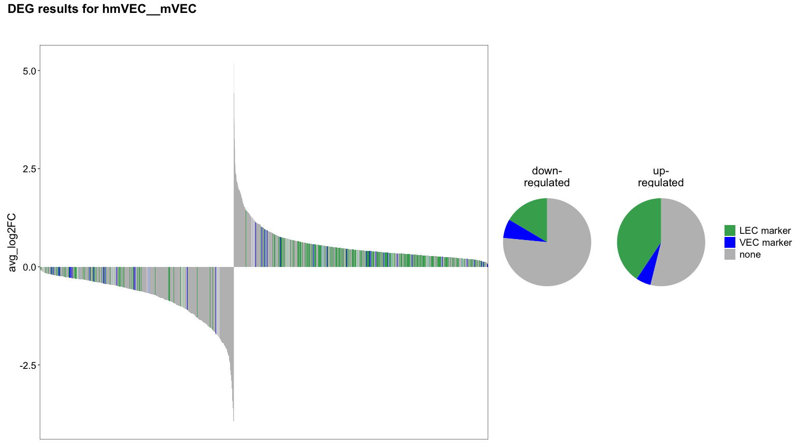
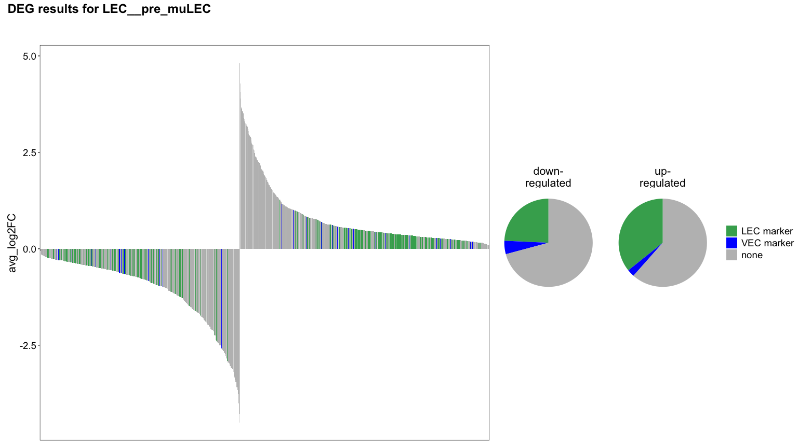
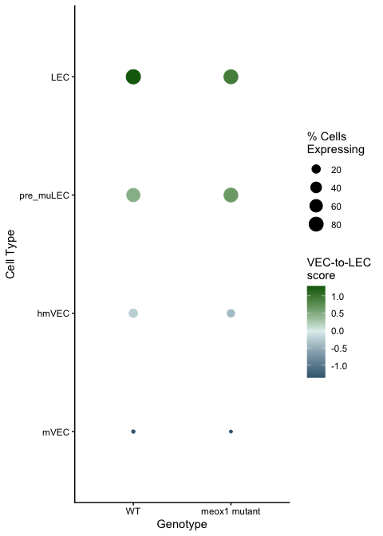
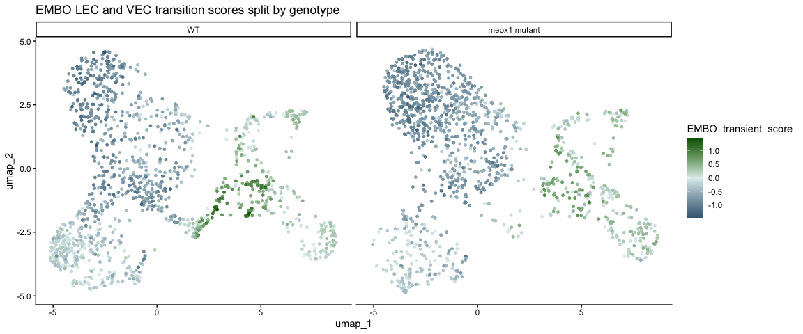
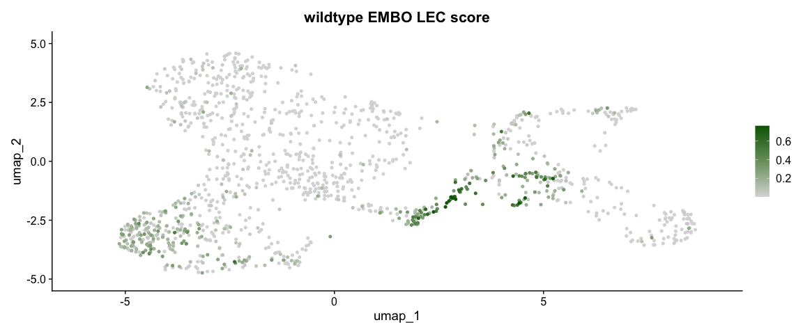
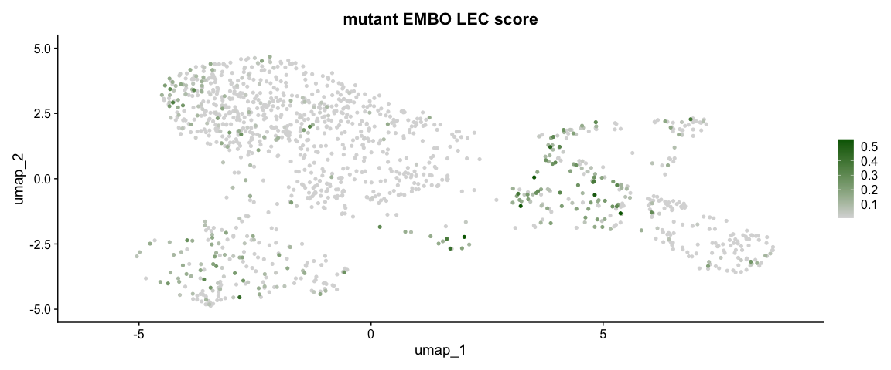
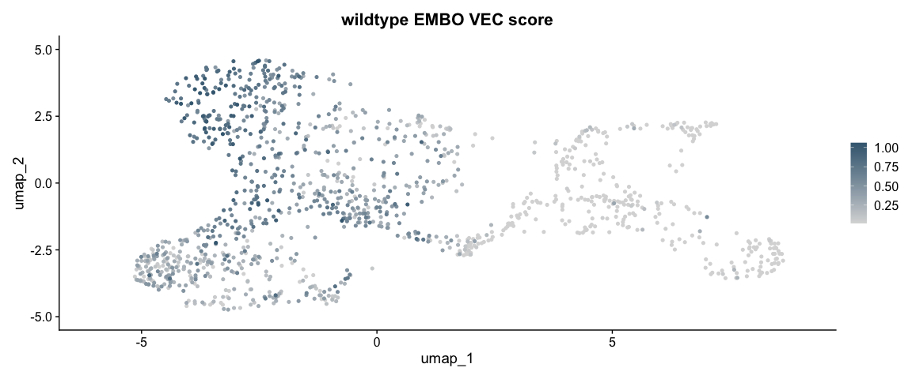
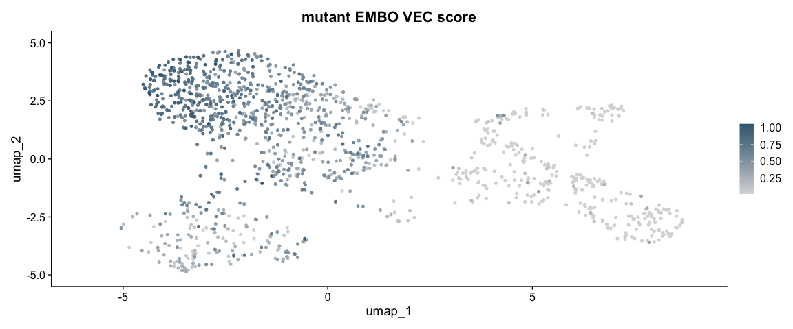

# README

Regenerates the EMBO-method LEC/VEC marker score panels (figures 7D/7F/7G equivalents from the EMBO Journal
paper this method is adapted from), now split by genotype for the meox1 dataset:

1. LEC/VEC marker DEG barplots (with proportion pie charts) for both merged groups, using the EMBO 3-5dpf marker
   gene panel to flag known LEC/VEC direction. Also (re)generates the marker geneset CSVs consumed by
   `meox1_L3_correlation_logfc.Rmd`.
2. LEC-to-VEC transition score dotplot and per-genotype UMAP feature plots (`EMBO_transient_score`,
   `EMBO_LEC_score_1`, `EMBO_VEC_score_1`).

## Outputs

DEG barplots + regenerated genesets, under `../output/figure_extended/embo_scores/`:

- `embo_markers_degbarplot_VECs.{pdf,png}`, `embo_markers_degbarplot_LECs.{pdf,png}`

Regenerated genesets, under `../../Saki_data/Revision_analysis/data/genesets/` (shared static input, also read by
`meox1_L3_correlation_logfc.Rmd`):

- `EMBO_L2_VECLEC_markers_EMBOmethod_3_5dpf_genesforlabels_only.csv`
- `EMBO_L2_VECLEC_markers_EMBOmethod_3_5dpf_genesforscoring_only.csv`
- `EMBO_L2_VECLEC_markers_EMBOmethod_3_5dpf.csv`

Transition-score plots, under `../output/figure_extended/embo_scores/`:

- `embo_transition_scores_split_genotype_dotplot.{pdf,png}`
- `embo_transition_scores_split_genotype{,_strip}.{pdf,png}`
- `embo_transition_scores_{wt,mut}_{LEC,VEC}{,_strip}.{pdf,png}`

## Initial setup


```{.r .fold-hide}
library(patchwork)
library(qs2)
```

```
## qs2 0.2.1
```

```{.r .fold-hide}
library(Seurat)
```

```
## Loading required package: SeuratObject
```

```
## Loading required package: sp
```

```
## 
## Attaching package: 'SeuratObject'
```

```
## The following objects are masked from 'package:base':
## 
##     intersect, t
```

```{.r .fold-hide}
library(SeuratObject)
library(tidyverse)
```

```
## ── Attaching core tidyverse packages ──────────────────────────────────────────────────────────────────────────────── tidyverse 2.0.0 ──
## ✔ dplyr     1.2.1     ✔ readr     2.2.0
## ✔ forcats   1.0.1     ✔ stringr   1.6.0
## ✔ ggplot2   4.0.3     ✔ tibble    3.3.1
## ✔ lubridate 1.9.5     ✔ tidyr     1.3.2
## ✔ purrr     1.2.2
```

```
## ── Conflicts ────────────────────────────────────────────────────────────────────────────────────────────────── tidyverse_conflicts() ──
## ✖ dplyr::filter() masks stats::filter()
## ✖ dplyr::lag()    masks stats::lag()
## ℹ Use the conflicted package (<http://conflicted.r-lib.org/>) to force all conflicts to become errors
```

```{.r .fold-hide}
outfile_dir <- "../output/figure_extended/embo_scores/"
geneset_dir <- "../../Saki_data/Revision_analysis/data/genesets/"

data <- qs_read("../../Saki_data/paper/D10051_meox1_dataset_Level_03_annotated.qs2")

data$Genotype <- gsub("meox1_mutant", "meox1 mutant", data$Genotype)
data$Genotype <- gsub("wildtype", "WT", data$Genotype)
data$Genotype <- factor(
    data$Genotype,
    levels = c("WT", "meox1 mutant")
)
```

## LEC/VEC marker DEG barplots

Source: `meox1_L3_embo_degbarplot.R`. Recomputes the EMBO-method LEC/VEC marker panel from the EMBO Journal
Level 2 object (https://link.springer.com/article/10.15252/embj.2022112590), then plots the merged-group DEG
table coloured by marker direction.


```{.r .fold-hide}
all_degs <- read_csv(
    "../output/figure_extended/dge_confects/meox1_Level_03_DEG_mutVSwt_L3_celltype_merged_VEC_merged_LEC_fc0.00_minpct_0.01.csv",
    show_col_types = F
    )

genes_labels_path <- paste0(geneset_dir, "EMBO_L2_VECLEC_markers_EMBOmethod_3_5dpf_genesforlabels_only.csv")
genes_scoring_path <- paste0(geneset_dir, "EMBO_L2_VECLEC_markers_EMBOmethod_3_5dpf_genesforscoring_only.csv")
genes_everything_path <- paste0(geneset_dir, "EMBO_L2_VECLEC_markers_EMBOmethod_3_5dpf.csv")

# get markers based on the analysis performed for the EMBO paper above
Level_02_seuratObject <- readRDS("../../Saki_data/paper/EMBO_JOURNAL_Level_02_seuratObject_LM.RDS")
Level_02_seuratObject <- SetIdent(Level_02_seuratObject, value = 'L2_Phenotype_Stage')

# ---- write a function so we can speed things up a bit ----
run_LEC_VEC_markers <- function(seurat = Level_02_seuratObject,
                                timepoint){
  lec_idents <- c(sprintf("LEC_Stage_%idpf", timepoint), sprintf("LEC_prox1a_low_Stage_%idpf", timepoint))
  vec_idents <- c(sprintf("VEC_Stage_%idpf", timepoint))

  tmp_markers <- FindMarkers(object = seurat,
                             ident.1 = lec_idents,
                             ident.2 = vec_idents,
                             assay = "RNA",
                             logfc.threshold = 0.25, #threshold from EMBO paper
                             min.pct = 0.1) #threshold from EMBO paper
  #add expression ratio
  tmp_markers <- tmp_markers %>%
    mutate(., ExpnRatio = ifelse(avg_log2FC < 0, -(1/(pct.1/pct.2)), pct.1/pct.2),
              ExpnRatio = case_when(is.infinite(ExpnRatio) & pct.1 == 0 ~ 10000*pct.2, #replace infinite values with something as they're actually useful
                                    is.infinite(ExpnRatio) & pct.2 == 0 ~ 10000*pct.1,
                                    TRUE ~ ExpnRatio),
              direction = ifelse(avg_log2FC < 0, "VEC", "LEC"),
              timepoint = paste(timepoint, "dpf")) %>%
    rownames_to_column("Gene")

  #filter based on thresholds in EMBO paper
  genes <- tmp_markers %>%
    filter(., abs(ExpnRatio) > 1.5) #both up and down

  return(genes)

}

# ---- run for 3,4,5 dpf ----
list_all_timepoints <- lapply(c(3,4,5), function(TP) run_LEC_VEC_markers(timepoint = TP)) %>%
  bind_rows()

# ---- Get genes for LEC/VEC across all timepoints - to give genes labels ----
# note that this will ignore fold changes etc, this is for marking the genes as LEC or VEC markers
lec_vec <- list_all_timepoints %>%
  group_by(Gene) %>%
  mutate(., always_same_direction = ifelse(all(avg_log2FC > 0)|all(avg_log2FC <0), "yes", "no")) %>% #make sure the directionality is always lec or always vec
  filter(., always_same_direction == "yes") %>%
  select(., Gene, direction) %>%
  distinct() %>%
  filter(., !(grepl("si:|CABZ|zgc:|im:" ,Gene))) #EMBO paper also cleans up more and removes unannotated genes

lec_vec$direction %>% table()
```

```
## .
##  LEC  VEC 
## 2583  321
```

```{.r .fold-hide}
# ---- Get genes for LEC/VEC across all timepoints - for LEC/VEC scoring ----
lec_vec_scoring_genes <- list_all_timepoints %>%
  filter(., Gene %in% lec_vec$Gene & p_val_adj < 0.05) %>% # use genes from above + add significance threshold
  group_by(Gene) %>%
  reframe(., sum_log2fc = sum(avg_log2FC),
                direction = direction) %>%  #this is just for ranking them
  distinct() %>%
  group_by(direction) %>%
  top_n(., n = 25, wt = abs(sum_log2fc))

# ---- Export for plotting later ----
#only genes
write_csv(file = genes_labels_path, x = lec_vec, col_names = T)

#for scoring
write_csv(file = genes_scoring_path, x = lec_vec_scoring_genes, col_names = T)

#everything
write_csv(file = genes_everything_path, x = list_all_timepoints, col_names = T)

lec_vec_labels <- lec_vec

theme_for_deg_plot <- plot_sizing <- theme_bw() +
    theme(axis.title = element_text(size = 16),
        axis.text = element_text(size = 14, colour = "black"),
        axis.title.x=element_blank(),
        axis.text.x=element_blank(),
        axis.ticks.x=element_blank(),
        plot.title = element_text(size = 18),
        legend.title = element_blank(),
        legend.position = "none",
        panel.grid.major.x = element_blank(),
        panel.grid.major.y = element_blank(),
        panel.grid.minor.x = element_blank(),
        panel.grid.minor.y = element_blank())

# colour palette for marker direction - missing from meox1_L3_embo_degbarplot.R itself, recovered from
# analysis/figures_meox1_dataset.Rmd (the manuscript figure this script was adapted from), which defines
# the same three-way scale for the same plot.
colours <- c(
    none = "grey",
    `LEC marker` = "#41ab5d",
    `VEC marker` = "blue"
)

# make the actual barplots
plot_list <- lapply(unique(all_degs$group), function(GROUP){
    # MAIN PLOT
    plot <- all_degs %>%
    filter(., !(grepl("si:|CABZ|zgc:|im:" ,Gene))) %>%  #like EMBO, remove unannotated genes
    filter(., group == GROUP & p_val < 0.05) %>% # raw p-value to reduce density of plotting
    mutate(., plot_order_variable = ifelse(avg_log2FC < 0, "down", "up")) %>%
    left_join(., lec_vec_labels, by="Gene") %>%
    mutate(., direction = factor(ifelse(is.na(direction), "none", paste0(direction, " marker")), levels = c("LEC marker", "VEC marker", "none"))) %>%
    arrange(., plot_order_variable, -avg_log2FC) %>%    # primary key, then secondary key
    mutate(., Gene = factor(Gene, levels = unique(Gene))) %>%
    ggplot(., aes(x = Gene, y = avg_log2FC, fill= direction)) +
    geom_bar(stat = "identity") +
    theme_for_deg_plot+
    scale_fill_manual(values = colours)

    #PIE CHARTS
    in_pie <- all_degs %>%
    filter(., !(grepl("si:|CABZ|zgc:|im:" ,Gene))) %>%  #like EMBO, remove unannotated genes
    filter(., group == GROUP & p_val < 0.05) %>% # raw p-value to reduce density of plotting
    mutate(., plot_order_variable = ifelse(avg_log2FC < 0, "down-\nregulated", "up-\nregulated")) %>%
    left_join(., lec_vec_labels, by="Gene") %>%
    mutate(., direction = factor(ifelse(is.na(direction), "none", paste0(direction, " marker")), levels = c("LEC marker", "VEC marker", "none"))) %>%
    arrange(., plot_order_variable, -avg_log2FC) %>%    # primary key, then secondary key
    mutate(., Gene = factor(Gene, levels = unique(Gene))) %>%
    group_by(direction, plot_order_variable) %>%
    summarise(., count = n())
    pie   <- ggplot(in_pie, aes(x="",
                                y=count, fill=direction)) + geom_bar(width = 1, stat = "identity")+
    coord_polar("y", start=0)+
    scale_fill_manual(values = colours) +
    facet_wrap(~plot_order_variable, scale = "free") +
    theme_void() +
    theme(strip.text = element_text(size = 16),
        legend.title = element_blank(),
        legend.text = element_text(size=14))

    #COMBINE AND OUT
    plot_combined <- plot + pie + plot_annotation(title=paste0("DEG results for ", GROUP),
                                                theme = theme(plot.title = element_text(size = 18, face = "bold"))) + plot_layout(guides = "collect", widths = c(2,1))
    return(plot_combined)
})
```

```
## `summarise()` has regrouped the output.
## `summarise()` has regrouped the output.
## ℹ Summaries were computed grouped by direction and plot_order_variable.
## ℹ Output is grouped by direction.
## ℹ Use `summarise(.groups = "drop_last")` to silence this message.
## ℹ Use `summarise(.by = c(direction, plot_order_variable))` for per-operation grouping (`?dplyr::dplyr_by`) instead.
```

```{.r .fold-hide}
# the source script had an identical expression here BEFORE plot_list existed (would error) -
# this is the correctly-ordered version, left disabled to match the source's own commented-out copy
# wrap_elements(plot_list[[1]]) + wrap_elements(plot_list[[2]]) + plot_layout(guides = "collect", axes="collect", ncol=1)

print(plot_list[[1]])
```

<!-- -->

```{.r .fold-hide}
print(plot_list[[2]])
```

<!-- -->

```{.r .fold-hide}
ggsave(
    plot = plot_list[[1]],
    filename = paste0(outfile_dir, "embo_markers_degbarplot_VECs.pdf"),
    device = "pdf",
    height = 9,
    width = 16
    )
ggsave(
    plot = plot_list[[1]],
    filename = paste0(outfile_dir, "embo_markers_degbarplot_VECs.png"),
    device = "png",
    height = 9,
    width = 16
    )
ggsave(
    plot = plot_list[[2]],
    filename = paste0(outfile_dir, "embo_markers_degbarplot_LECs.pdf"),
    device = "pdf",
    height = 9,
    width = 16
    )
ggsave(
    plot = plot_list[[2]],
    filename = paste0(outfile_dir, "embo_markers_degbarplot_LECs.png"),
    device = "png",
    height = 9,
    width = 16
    )
```

## LEC-to-VEC transition scores, split by genotype

Source: `meox1_L3_embo_genotype.R`.


```{.r .fold-hide}
midpoint <- mean(range(data@meta.data$EMBO_transient_score))

# combine genotype
data$celltype_genotype <- paste(data$L3_celltype, data$Genotype, sep = "___")

# calculate values only
base_plt <- DotPlot(data, features = "EMBO_transient_score", group.by = "celltype_genotype")
df <- base_plt$data

# reconstruct celltype genotype
df_split <- do.call(rbind, strsplit(as.character(df$id), "___"))
df$Celltype <- df_split[, 1]
df$Genotype <- df_split[, 2]

# retain order
cell_order <- c("LEC", "pre_muLEC", "hmVEC", "mVEC")
df$Celltype <- factor(df$Celltype, levels = rev(cell_order))
df$Genotype <- factor(df$Genotype, levels = c("WT", "meox1 mutant"))

# custom ggplot
plt <- ggplot(df, aes(x = Genotype, y = Celltype, size = pct.exp, color = avg.exp.scaled)) +
    geom_point() +
    scale_color_gradient2(
        low = "#406880",
        high = "darkgreen",
        mid = "azure2",
        midpoint = midpoint
    ) +
    labs(
        x = "Genotype",
        y = "Cell Type",
        color = "VEC-to-LEC\nscore",
        size = "% Cells\nExpressing"
    ) +
    theme(
        axis.text.x = element_text(angle = 45, hjust = 1, vjust = 1),
        panel.grid.major = element_line(color = "grey90")
    ) +
    theme_classic()

print(plt)
```

<!-- -->

```{.r .fold-hide}
ggsave(
    plot = plt,
    filename = paste0(outfile_dir, "embo_transition_scores_split_genotype_dotplot.pdf"),
    device = "pdf",
    height = 7,
    width = 5
    )
ggsave(
    plot = plt,
    filename = paste0(outfile_dir, "embo_transition_scores_split_genotype_dotplot.png"),
    device = "png",
    height = 7,
    width = 5
    )
```


```{.r .fold-hide}
wt <- data[,data@meta.data$Genotype == "WT"]
mut <- data[,data@meta.data$Genotype == "meox1 mutant"]

md <- data[[]]
coords <- Embeddings(data[["umap"]])
md <- cbind(md, coords)

midpoint <- mean(range(md$EMBO_transient_score))

# Order by absolute difference from the midpoint
md <- md[order(abs(md$EMBO_transient_score - midpoint)), ]

plt <- ggplot(md, aes(x = umap_1, y = umap_2, color = EMBO_transient_score)) +
    geom_point(size = 1) +
    scale_color_gradient2(low = "#406880", high = "darkgreen", mid = "azure2", midpoint = midpoint) +
    facet_wrap(~ Genotype) +
    theme_classic() +
    ggtitle("EMBO LEC and VEC transition scores split by genotype")

print(plt)
```

<!-- -->

```{.r .fold-hide}
ggsave(
    plot = plt,
    filename = paste0(outfile_dir, "embo_transition_scores_split_genotype.pdf"),
    device = "pdf",
    height = 5,
    width = 12
    )
ggsave(
    plot = plt,
    filename = paste0(outfile_dir, "embo_transition_scores_split_genotype.png"),
    device = "png",
    height = 5,
    width = 12
    )

plt_strip <- plt + NoAxes() + NoLegend() + theme(plot.title = element_blank())

ggsave(
    plot = plt_strip,
    filename = paste0(outfile_dir, "embo_transition_scores_split_genotype_strip.pdf"),
    device = "pdf",
    height = 5,
    width = 10
    )
ggsave(
    plot = plt_strip,
    filename = paste0(outfile_dir, "embo_transition_scores_split_genotype_strip.png"),
    device = "png",
    height = 5,
    width = 10
    )

# split
scores <- c("EMBO_LEC_score_1", "EMBO_VEC_score_1")
lec_cols <- c("#d9d9d9", "darkgreen")
vec_cols <- c("#d9d9d9", "#406880")

make_score_umap <- function(seurat, feature, cols, title, name) {
    plt <- FeaturePlot(seurat, features = feature, cols = cols,
        pt.size = 1, min.cutoff = "q1", max.cutoff = "q99",
        order = TRUE) + ggtitle(title)

    ggsave(plot = plt, filename = paste0(outfile_dir, name, ".pdf"), device = "pdf", height = 7, width = 7)
    ggsave(plot = plt, filename = paste0(outfile_dir, name, ".png"), device = "png", height = 7, width = 7)

    plt_strip <- plt + NoAxes() + NoLegend() + theme(plot.title = element_blank())
    ggsave(plot = plt_strip, filename = paste0(outfile_dir, name, "_strip.pdf"), device = "pdf", height = 5, width = 5)
    ggsave(plot = plt_strip, filename = paste0(outfile_dir, name, "_strip.png"), device = "png", height = 5, width = 5)

    plt
}

print(make_score_umap(wt, "EMBO_LEC_score_1", lec_cols, "wildtype EMBO LEC score", "embo_transition_scores_wt_LEC"))
```

<!-- -->

```{.r .fold-hide}
print(make_score_umap(mut, "EMBO_LEC_score_1", lec_cols, "mutant EMBO LEC score", "embo_transition_scores_mut_LEC"))
```

<!-- -->

```{.r .fold-hide}
print(make_score_umap(wt, "EMBO_VEC_score_1", vec_cols, "wildtype EMBO VEC score", "embo_transition_scores_wt_VEC"))
```

<!-- -->

```{.r .fold-hide}
print(make_score_umap(mut, "EMBO_VEC_score_1", vec_cols, "mutant EMBO VEC score", "embo_transition_scores_mut_VEC"))
```

<!-- -->

## For developers

Sample run command:


``` bash
Rscript -e "
rmarkdown::render(
  'meox1_embo_lecvec_scores.Rmd',
  output_file = './meox1_embo_lecvec_scores.html'
)
"
```
