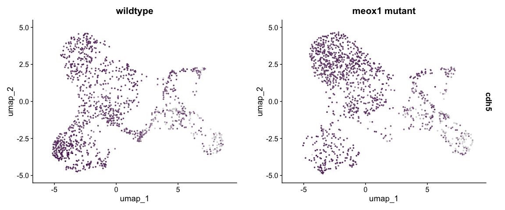
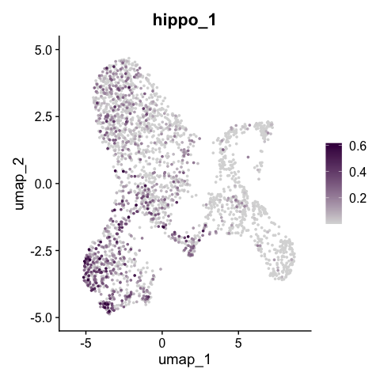
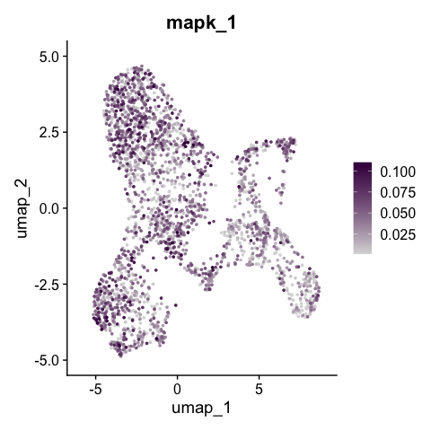
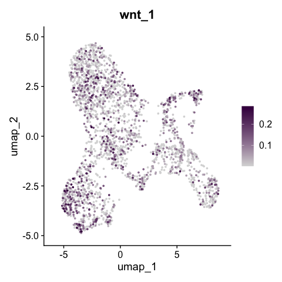
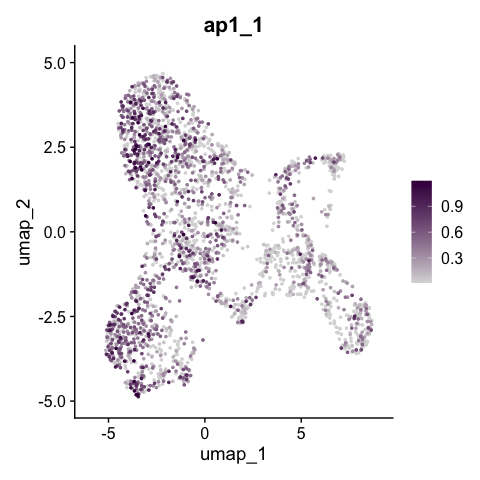

# README

Two UMAP feature-plot panels on the Level 3 meox1 dataset:

1. `cdh5` expression split by genotype (with/without legend, with/without axes).
2. Four pathway module scores (`hippo_1`, `mapk_1`, `wnt_1`, `ap1_1`) plotted individually, each with a
   labelled and a stripped (axis/legend-free) version for figure composition.

## Outputs

All under `../output/figure_extended/umap/`:

- `meox1_UMAP_cdh5_split_Genotype.pdf`, `meox1_UMAP_STRIPPED_cdh5_split_Genotype.pdf`
- `meox1_UMAP_LEGEND_cdh5_split_Genotype.pdf`, `meox1_UMAP_LEGEND_ONLY_cdh5_split_Genotype.pdf`
- `meox1_scoreplots_L03_UMAP_{hippo_1,mapk_1,wnt_1,ap1_1}.pdf` and `_STRIPPED_` variants

## cdh5 UMAP split by genotype

Source: `meox1_umap_cdh5_genotype.R`.


```{.r .fold-hide}
library(cowplot)
library(ggplot2)
library(patchwork)
```

```
## 
## Attaching package: 'patchwork'
```

```
## The following object is masked from 'package:cowplot':
## 
##     align_plots
```

```{.r .fold-hide}
library(qs2)
```

```
## qs2 0.2.1
```

```{.r .fold-hide}
library(Seurat)
```

```
## Loading required package: SeuratObject
```

```
## Loading required package: sp
```

```
## 
## Attaching package: 'SeuratObject'
```

```
## The following objects are masked from 'package:base':
## 
##     intersect, t
```

```{.r .fold-hide}
library(SeuratWrappers)
```

```
## Warning: package 'SeuratWrappers' was built under R version 4.5.2
```

```{.r .fold-hide}
library(tidyverse)
```

```
## ── Attaching core tidyverse packages ──────────────────────────────────────────────────────────────────────────────── tidyverse 2.0.0 ──
## ✔ dplyr     1.2.1     ✔ readr     2.2.0
## ✔ forcats   1.0.1     ✔ stringr   1.6.0
## ✔ lubridate 1.9.5     ✔ tibble    3.3.1
## ✔ purrr     1.2.2     ✔ tidyr     1.3.2
```

```
## ── Conflicts ────────────────────────────────────────────────────────────────────────────────────────────────── tidyverse_conflicts() ──
## ✖ dplyr::filter()    masks stats::filter()
## ✖ dplyr::lag()       masks stats::lag()
## ✖ lubridate::stamp() masks cowplot::stamp()
## ℹ Use the conflicted package (<http://conflicted.r-lib.org/>) to force all conflicts to become errors
```

```{.r .fold-hide}
outfile_dir <- "../output/figure_extended/umap/"
expression_colours <- c("#d9d9d9", "#40004b")

infile_path <- "../../Saki_data/paper/D10051_meox1_dataset_Level_03_annotated.qs2"
data <- qs_read(infile_path)
table(data@meta.data$Genotype)
```

```
## 
## meox1_mutant     wildtype 
##         1288         1287
```

```{.r .fold-hide}
group.by <- "Genotype"

recode_D10051 <- c(
    "wildtype"="wildtype",
    "meox1_mutant"="meox1 mutant"
)
order_D10051 <- c(
    "wildtype",
    "meox1 mutant"
)
col_map_D10051 <- c(
    "wildtype" = "#dbe2c6", #wildtype
    "meox1 mutant" = "#657c95" #mutant
)

data$Genotype <- recode(data$Genotype, !!!recode_D10051)
data$Genotype <- factor(data$Genotype, levels=order_D10051)

make_feature_split_umap <- function(seurat,
                              feature,
                              width,
                              height,
                              path,
                              name,
                              split,
                              point_size = 0.5,
                              colours = expression_colours) {
  # prioritise legend
  plot_legend <- FeaturePlot(seurat,
                      features = feature,
                      cols = colours,
                      split.by = split,
                      pt.size = point_size) &
                      theme(legend.position="right")

  filename <- paste0(name, "_UMAP_LEGEND_", feature, "_split_", split ,".pdf")
  cat(filename, "\n")
  ggsave(plot = plot_legend,
         filename = filename,
         path = path,
         device = "pdf",
         height = height,
         width = width + 2)

  filename <- paste0(name, "_UMAP_LEGEND_ONLY_", feature, "_split_", split ,".pdf")
  cat(filename, "\n")
  legend <- get_legend(plot_legend)
  ggsave(plot = legend,
        filename = filename,
        path = path,
        device = "pdf",
        width = 1,
        height = 2)

  plot <- FeaturePlot(seurat,
                      features = feature,
                      cols = colours,
                      split.by = split,
                      pt.size = point_size)

  #with everything
  filename <- paste0(name, "_UMAP_", feature, "_split_", split ,".pdf")
  cat(filename, "\n")
  ggsave(plot = plot,
         filename = filename,
         path = path,
         device = "pdf",
         height = height+2,
         width = width + 2)

  #stipped
  plot_strip <- plot & NoAxes() & NoLegend() & theme(plot.title = element_blank())
  filename <- paste0(name, "_UMAP_STRIPPED_", feature, "_split_", split ,".pdf")
  cat(filename, "\n")
  ggsave(plot = plot_strip,
         filename = filename,
         path = path,
         device = "pdf",
         height = height,
         width = width)

  return(plot)
}

plt <- make_feature_split_umap(
    seurat=data,
    feature="cdh5",
    width=10,
    height=5,
    path=outfile_dir,
    name="meox1",
    split="Genotype",
    point_size=0.5,
    colours=expression_colours
    )
```

```
## meox1_UMAP_LEGEND_cdh5_split_Genotype.pdf
```

```
## meox1_UMAP_LEGEND_ONLY_cdh5_split_Genotype.pdf 
## meox1_UMAP_cdh5_split_Genotype.pdf
```

```
## meox1_UMAP_STRIPPED_cdh5_split_Genotype.pdf
```

```{.r .fold-hide}
print(plt)
```

<!-- -->

## Pathway module score UMAPs

Source: `meox1_scoreplots.R`. Plots four pre-computed module scores individually.


```{.r .fold-hide}
genescores_to_plot <- c("hippo_1", "mapk_1", "wnt_1", "ap1_1")

make_genescore_umap <- function(seurat,
                              feature,
                              width,
                              height,
                              path,
                              name,
                              point_size = 0.5,
                              colours = expression_colours){
  plot <- FeaturePlot(seurat,
                      features = feature,
                      cols = colours,
                      pt.size = point_size,
                      min.cutoff = "q1",
                      max.cutoff =  "q99",
                      order = T)

  #with everything
  filename <- paste0(name, "_UMAP_", feature, ".pdf")
  ggsave(plot = plot,
         filename = filename,
         path = path,
         device = "pdf",
         height = height+2,
         width = width + 2)

  #stipped
  plot_strip <- plot + NoAxes() + NoLegend() + theme(plot.title = element_blank())
  filename <- paste0(name, "_UMAP_STRIPPED_", feature, ".pdf")
  ggsave(plot = plot_strip,
         filename = filename,
         path = path,
         device = "pdf",
         height = height,
         width = width)

  return(plot)
}

score_plots <- lapply(genescores_to_plot, function(genescore) {
    plt <- make_genescore_umap(
        seurat = data,
        feature = genescore,
        width = 5, height = 5,
        path = outfile_dir,
        name = "meox1_scoreplots_L03"
    )
    print(plt)
    plt
})
```

<!-- --><!-- --><!-- --><!-- -->

## For developers

Sample run command:


``` bash
Rscript -e "
rmarkdown::render(
  'meox1_umap_feature_plots.Rmd',
  output_file = './meox1_umap_feature_plots.html'
)
"
```
