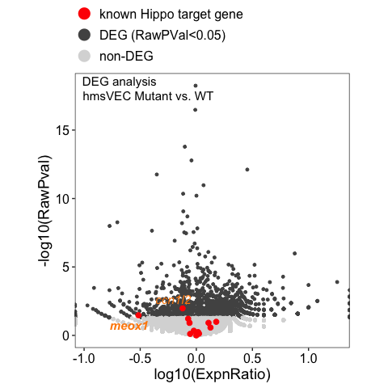
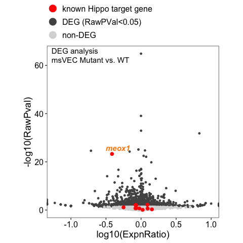

# README

Revision history carried over from source comments:

- v1 (2026-03-17): redo of the hmVEC/mVEC volcano plots so the y-axis is `-log10(raw p-value)` and the x-axis is
  `log10(expression ratio)`, with DEGs coloured.
- v2 (2026-03-18): kept axis bounds as originally requested; switched DEG colouring from adjusted p-value to raw
  p-value < 0.05.
- v3 (2026-05-26): split into separate hmVEC and mVEC versions (this document covers both).

Known Hippo pathway target genes are highlighted in red with labels; `meox1` itself is bold-italicised.

## Outputs

Both under `../output/figure_extended/volcano/`:

- `meox1_dataset_Level_03_hmVEC_volcano_pvalue_RAW.pdf`
- `meox1_dataset_Level_03_mVEC_volcano_pvalue_RAW.pdf`

## Initial setup


```{.r .fold-hide}
library(tidyverse)
```

```
## ── Attaching core tidyverse packages ──────────────────────────────────────────────────────────────────────────────── tidyverse 2.0.0 ──
## ✔ dplyr     1.2.1     ✔ readr     2.2.0
## ✔ forcats   1.0.1     ✔ stringr   1.6.0
## ✔ ggplot2   4.0.3     ✔ tibble    3.3.1
## ✔ lubridate 1.9.5     ✔ tidyr     1.3.2
## ✔ purrr     1.2.2     
## ── Conflicts ────────────────────────────────────────────────────────────────────────────────────────────────── tidyverse_conflicts() ──
## ✖ dplyr::filter() masks stats::filter()
## ✖ dplyr::lag()    masks stats::lag()
## ℹ Use the conflicted package (<http://conflicted.r-lib.org/>) to force all conflicts to become errors
```

```{.r .fold-hide}
library(ggplot2)
library(qs2)
```

```
## qs2 0.2.1
```

```{.r .fold-hide}
library(Seurat)
```

```
## Loading required package: SeuratObject
## Loading required package: sp
## 
## Attaching package: 'SeuratObject'
## 
## The following objects are masked from 'package:base':
## 
##     intersect, t
```

```{.r .fold-hide}
outfile_dir <- "../output/figure_extended/volcano/"

all_degs <- read_csv(
    "../../Saki_data/analysis/D10051_meox1_dataset/DEGs/Level_03_DEG_mutVSwt_L3_celltype_fc0.00_minpct_0.01.csv",
    show_col_types = F
    )

hippo_targets <- c(
    "yap1",
    "wwtr1",
    "ccn2a",
    "ccn2b",
    "amotl2a",
    "amotl2b",
    "ccn1",
    "ccn1l2",
    "cavin1b",
    "cavin2a",
    "cavin2b",
    "bmp4",
    "meox1"
    )

plot_sizing <- theme_bw() + theme(
    axis.title = element_text(size = 16),
    axis.text = element_text(size = 14, colour = "black"),
    plot.title = element_text(size = 18),
    legend.text = element_text(size = 14),
    legend.title = element_blank(),
    panel.grid = element_blank(),
    legend.position = "top",
    legend.justification = "left"
)

# add expression ratios
all_degs$ExpnRatio <- all_degs$pct.1 / all_degs$pct.2
all_degs$LogExpnRatio <- log10(all_degs$ExpnRatio)

make_volcano <- function(all_degs, hippo_targets, group_label, subtitle_label) {
    group_data <- all_degs %>%
        filter(group == group_label) %>%
        mutate(sig = ifelse(p_val < 0.05, "DEG (RawPVal<0.05)", "non-DEG"))

    hippo_mark <- all_degs %>%
        filter(group == group_label & Gene %in% hippo_targets) %>%
        mutate(sig = ifelse(p_val < 0.05, "DEG (RawPVal<0.05)", "non-DEG"))

    group_data %>%
        ggplot(aes(x = LogExpnRatio, y = -log10(p_val), colour = sig)) +
        geom_point(size=1) +
        geom_point(data = hippo_mark, colour="red", size=2, show.legend=FALSE) +
        ggrepel::geom_text_repel(
            data = hippo_mark,
            aes(label=Gene, fontface=ifelse(Gene=="meox1", "bold.italic", "italic")),
            size=4, colour="#ff8a04", show.legend=FALSE
        ) +
        scale_colour_manual(
            values = c(
                "known Hippo target gene" = "red",
                "DEG (RawPVal<0.05)" = "#525252",
                "non-DEG" = "#d9d9d9"
            ),
            breaks = c("known Hippo target gene", "DEG (RawPVal<0.05)", "non-DEG")
        ) +
        geom_point(data=data.frame(LogExpnRatio=NA_real_, p_val=NA_real_,
                                   sig="known Hippo target gene"), aes(colour=sig)) +
        guides(colour = guide_legend(override.aes = list(shape=16, size=5), ncol=1)) +
        geom_text(
            data = data.frame(x=-Inf, y=Inf),
            aes(x=x, y=y, label="DEG analysis"),
            hjust=-0.1, vjust=1.4, size=4, colour="black",
            inherit.aes=FALSE
        ) +
        geom_text(
            data = data.frame(x=-Inf, y=Inf),
            aes(x=x, y=y, label=subtitle_label),
            hjust=-0.06, vjust=3.0, size=4, colour="black",
            inherit.aes=FALSE
        ) +
        labs(y="-log10(RawPval)", x="log10(ExpnRatio)") +
        theme_bw() +
        theme(
            axis.title = element_text(size=14),
            axis.text = element_text(size=12, colour="black"),
            legend.text = element_text(size=12),
            legend.title = element_blank(),
            legend.position = "top",
            legend.justification = "left",
            legend.background = element_blank(),
            legend.key = element_blank(),
            panel.grid = element_blank(),
            legend.spacing.y = unit(0.0, "cm"),
            legend.key.height = unit(0.3, "cm"),
            legend.margin = margin(0, 0, -2, 0),
            aspect.ratio = 1
        )
}
```

## hmVEC volcano

Source: `meox1_edit_hmvec.R`.


```{.r .fold-hide}
plot_hmvec <- make_volcano(all_degs, hippo_targets, "hmVEC", "hmsVEC Mutant vs. WT")
print(plot_hmvec)
```

```
## Warning: Removed 1 row containing missing values or values outside the scale
## range (`geom_point()`).
```

<!-- -->

```{.r .fold-hide}
ggsave(
    paste0(outfile_dir, "meox1_dataset_Level_03_hmVEC_volcano_pvalue_RAW.pdf"),
    plot_hmvec,
    device="pdf",
    width=5,
    height=5
    )
```

```
## Warning: Removed 1 row containing missing values or values outside the scale
## range (`geom_point()`).
```

## mVEC volcano

Source: `meox1_edit_mvec.R`.


```{.r .fold-hide}
plot_mvec <- make_volcano(all_degs, hippo_targets, "mVEC", "msVEC Mutant vs. WT")
print(plot_mvec)
```

```
## Warning: Removed 1 row containing missing values or values outside the scale
## range (`geom_point()`).
```

<!-- -->

```{.r .fold-hide}
ggsave(
    paste0(outfile_dir, "meox1_dataset_Level_03_mVEC_volcano_pvalue_RAW.pdf"),
    plot_mvec,
    device="pdf",
    width=5,
    height=5
    )
```

```
## Warning: Removed 1 row containing missing values or values outside the scale
## range (`geom_point()`).
```

## For developers

Sample run command:


``` bash
Rscript -e "
rmarkdown::render(
  'meox1_volcano_plots.Rmd',
  output_file = './meox1_volcano_plots.html'
)
"
```
